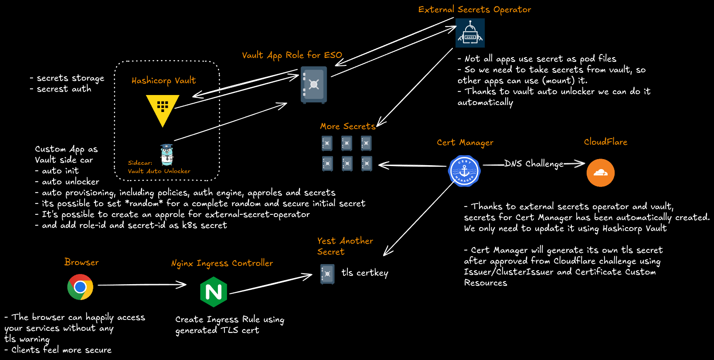
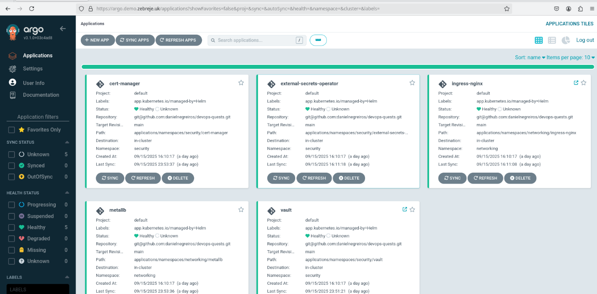

# Challenge 01: TLS Certificate Automation 🔐

Goal: Deploy an almost fully automated solution for issuing and renewing TLS certificates in a Kubernetes cluster using **ArgoCD** and **Helm**.

### Steps
1. All resources set up [ArgoCD](../../../deployment/argocd/values.yaml)
2. Install and configure [Vault](../../../deployment/applications/namespaces/security/vault/values.yaml)
3. Install and configure [vault-auto-unlocker](../../../deployment/applications/namespaces/security/vault/templates/vault-manager-config.yaml)
4. Install and configure [external-secrets-operator](../../../deployment/applications/namespaces/security/external-secrets-operator/templates/cluster-secret-store-vault.yaml)
5. Install and configure [CertManager](../../../deployment/applications/namespaces/security/cert-manager/templates/ingress-tls.yaml)
6. Install and configure Nginx [Ingress Controller](../../../deployment/applications/namespaces/networking/ingress-nginx/values.yaml)
7. Create a Domain in Cloudflare and generate API Token (Manual process)
8. Update API Token in deployed Vault
9. Create [Ingress](../../../deployment/applications/namespaces/networking/ingress-nginx/templates/argo.ingress.yml) to make use of the certificates

### Results

You should see that your browser has accepted the valid TLS certificate.

