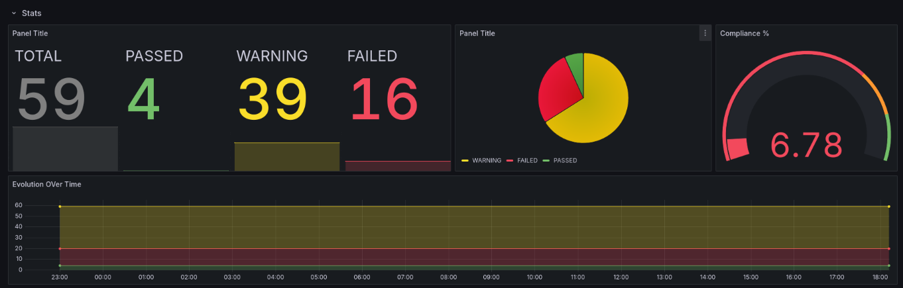
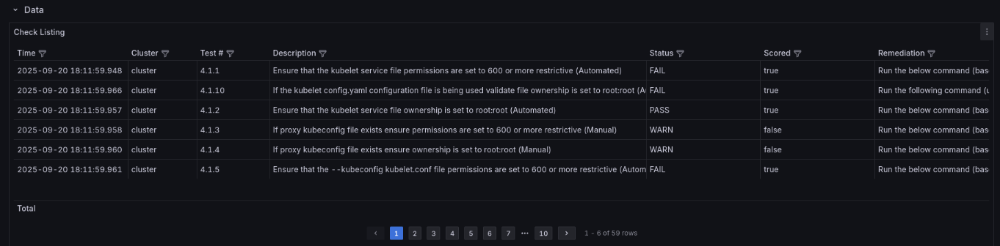

# Challenge 02: 🧭 Kube-bench Findings Scraper → DB → Visualization 🔐

Currently, kube-bench results are stored as raw logs, which makes it hard to query or track security posture over time.  
A small service should parse kube-bench JSON output, persist it, and provide a data source for dashboards and alerts.

### Steps

This setup builds on top of the services implemented in [challenge 1](../01-tls-cert-automation/README.md)

1. Adapt the [kube-bench job](https://github.com/aquasecurity/kube-bench/blob/main/job.yaml) provided by Aqua Security as a [CronJob](../../../deployment/applications/namespaces/security/kube-bench-exporter/templates/bench-export-cron-job.yaml).  
2. Include a **sidecar** to parse the logs from the kube-bench pod and export them to the database.  
3. Deploy a [PostgreSQL Pod](../../../deployment/applications/namespaces/security/kube-bench-exporter/templates/pg-deployment.yaml) with a PostgreSQL database.  
4. Wrap everything into a [Helm chart](../../../deployment/applications/namespaces/security/kube-bench-exporter/values.yaml).

> **Note:**  
> We reuse the setup from Challenge 1 so that random secrets are automatically generated and exposed as Kubernetes secrets. This allows the setup to work without ever manually checking the PostgreSQL username or password.

### Results

- **Stats**

- **Data**

---

💡 In the future, we may include these findings as Alertmanager alerts and integrate them with **Grafana**.
